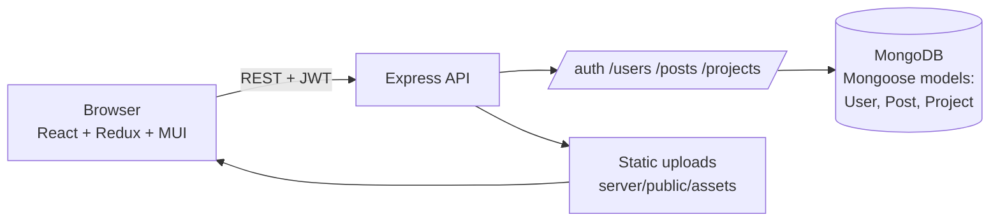

# Infinity Project

Infinity Project is a full-stack social and collaboration network where users share posts, build a friend network, bookmark content and track their projects. Built with the MERN stack (MongoDB, Express, React, Node.js) as a project for my Business Intelligence diploma at the Higher Institute of Management of Bizerte (ISG Bizerte).

## Features

- **Authentication**: registration with profile picture upload, login with JWT, passwords hashed with bcrypt, protected routes on both client and server.
- **Feed and posts**: create posts with an optional picture, like, comment (add, edit, delete) and share.
- **Social graph**: add or remove friends, browse friend lists and user profiles.
- **Bookmarks**: save posts and browse them on a dedicated page.
- **Search**: search posts and projects from the navigation bar.
- **Projects tracker**: create, edit and delete projects with start and end dates and a status (`Not Started`, `In Progress`, `Completed`).

## Tech stack

| Layer | Technologies |
|-------|--------------|
| Client | React 18 (Create React App), Redux Toolkit + redux-persist, React Router 6, Material UI, Formik + Yup, react-dropzone |
| Server | Node.js, Express, Mongoose, JSON Web Tokens, bcrypt, multer, helmet, morgan, cors |
| Database | MongoDB (Atlas or local) |

## Architecture



## Screenshots

<!-- Add screenshots to docs/images/ and link them here, e.g.  -->

| | |
|---|---|
| *Login / register* → `docs/images/login.png` | *Home feed* → `docs/images/feed.png` |
| *Profile* → `docs/images/profile.png` | *Projects page* → `docs/images/projects.png` |

## Getting started

**Prerequisites:** Node.js 18+ and a MongoDB database (a free [MongoDB Atlas](https://www.mongodb.com/atlas) cluster works).

### 1. Server

```bash
cd server
npm install
cp .env.example .env     # set MONGO_URL and JWT_SECRET, keep PORT=3001
npm start
```

### 2. Client

```bash
cd client
npm install
npm start                # http://localhost:3000
```

The client calls the API at `http://localhost:3001`, so start the server first. Create an account on the login page to get started.

## API overview

| Route | Description |
|-------|-------------|
| `POST /auth/register`, `POST /auth/login` | Create an account, sign in |
| `GET /users/:id`, `/users/:id/friends`, `/users/:id/bookmarks` | Profile, friends, bookmarks |
| `PATCH /users/:id/:friendId` | Add or remove a friend |
| `GET/POST /posts`, `GET /posts/:userId/posts` | Feed, create post, user posts |
| `PATCH /posts/:id/like`, `POST /posts/:id/share` | Like, share |
| `POST/PATCH/DELETE /posts/:postId/comments…` | Comments |
| `GET/POST /projects`, `PATCH/DELETE /projects/:id` | Projects tracker |

All routes except login and registration require an `Authorization: Bearer <token>` header.

## Repository structure

```
.
├── client/          React app (src/scenes, src/components, src/state)
└── server/
    ├── controllers/ route handlers
    ├── models/      Mongoose schemas (User, Post, Project)
    ├── routes/      Express routers
    ├── middleware/  JWT verification
    └── index.js     server entry point
```

## Author

**Walid Gabtni**: Business Intelligence diploma, Higher Institute of Management of Bizerte.
GitHub: [@WalidGabtni](https://github.com/WalidGabtni)
