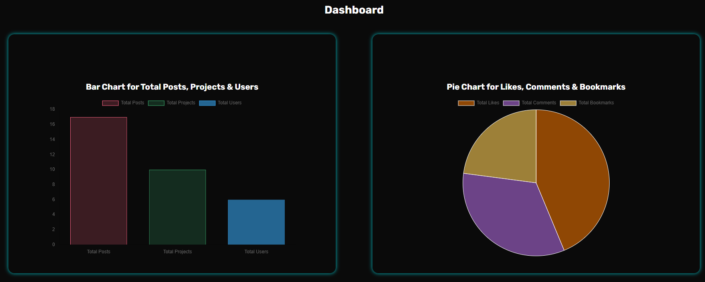
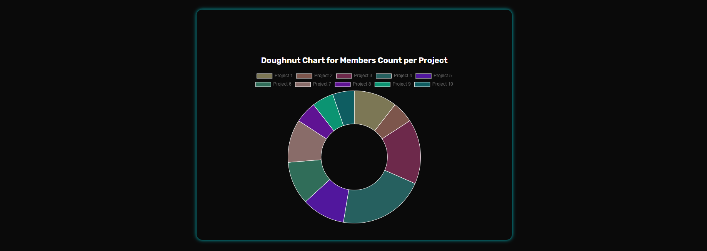
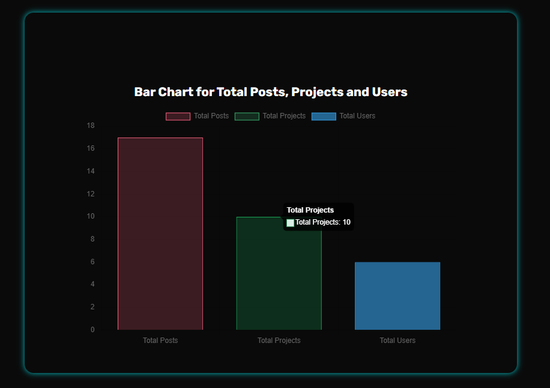
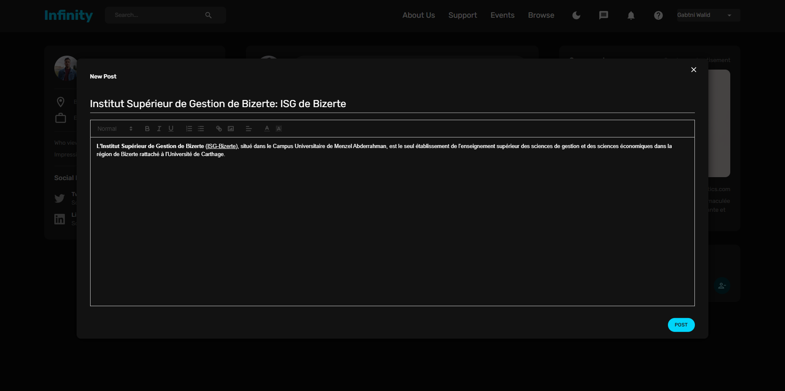
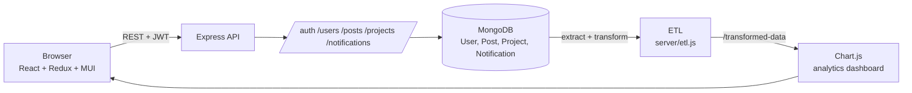

# Infinity Project

Infinity Project is a full-stack collaboration platform for communities and teams, built for the startup **IT Grow**. Users share posts, build a friend network and bookmark content, and can create or join **projects** that have members with roles, public and private discussion topics, moderation tools and an archive. An admin area manages users and roles, and an **ETL pipeline feeds an analytics dashboard**. Built with the MERN stack (MongoDB, Express, React, Node.js) for my Business Intelligence diploma at the Higher Institute of Management of Bizerte (ISG Bizerte).

> The complete application lives on the **`third`** branch. `main` holds an earlier version.

## Features

**Social network**
- Registration with profile picture, JWT login, bcrypt-hashed passwords.
- Feed with posts (rich-text editor and picture), likes, comments, sharing, edit and delete.
- Friends, user profiles and bookmarks; search across posts and projects.

**Projects and topics**
- Create projects with a profile image and cover, status and dates.
- Join requests with accept and refuse, delivered as notifications.
- Member roles: Project Owner, Admin, Moderator, Member; member management and removal.
- Public and private topics per project, with comments, plus pin, lock, hide and move moderation actions.
- Archive section for finished topics.

**Admin and analytics**
- Admin dashboard to browse, filter and delete users and change their role.
- `GET /transformed-data` runs an **ETL step** (`server/etl.js`) that extracts users, posts, projects and notifications from MongoDB and returns a cleaned, flattened dataset.
- Dashboard built with Chart.js: totals of posts, projects and users, members per project, posts and projects over time, per-user activity, and likes / comments / bookmarks distribution.

## Screenshots



| | |
|---|---|
|  |  |



<!-- Add more, e.g. docs/images/feed.png and docs/images/project-topics.png -->

## Tech stack

| Layer | Technologies |
|-------|--------------|
| Client | React 18 (Create React App), Redux Toolkit + redux-persist, React Router 6, Material UI, Formik + Yup, React Quill, Chart.js (react-chartjs-2), react-dropzone, react-avatar-editor |
| Server | Node.js, Express, Mongoose, JSON Web Tokens, bcrypt, multer, helmet, morgan, cors |
| Database | MongoDB (Atlas or local) |

## Architecture



## Getting started

**Prerequisites:** Node.js 18+ and a MongoDB database (a free [MongoDB Atlas](https://www.mongodb.com/atlas) cluster works).

```bash
git clone -b third https://github.com/WalidGabtni/Infinity-Project1.git
cd Infinity-Project1
```

**Server**

```bash
cd server
npm install
cp .env.example .env     # set MONGO_URL and JWT_SECRET, keep PORT=3001
npm start
```

**Client**

```bash
cd client
npm install
npm start                # http://localhost:3000
```

The client calls the API at `http://localhost:3001`, so start the server first. Register an account on the login page. To use the admin area, set a user's `role` to `admin` in the database.

## API overview

| Route group | Description |
|-------------|-------------|
| `/auth` | Register, login |
| `/users` | Profiles, friends, bookmarks, admin: list users, change role, delete |
| `/posts` | Feed, create, like, share, comments, search |
| `/projects` | Create, join and leave, members and roles, public / private / archive topics and moderation |
| `/notifications` | Join requests, accept, refuse, list |
| `GET /transformed-data` | ETL output used by the dashboard |

All routes except login and registration require an `Authorization: Bearer <token>` header.

## Repository structure

```
.
├── client/src/
│   ├── scenes/       pages: login, home, profile, bookmarks, projects, admin dashboard
│   ├── components/   shared UI: breadcrumbs, notifications, member and topic components
│   └── state/        Redux store
└── server/
    ├── controllers/  route handlers
    ├── models/       User, Post, Project, Notification
    ├── routes/       Express routers
    ├── middleware/   JWT verification
    ├── etl.js        extract-transform step for analytics
    └── index.js      server entry point
```

## Author

**Walid Gabtni**: Business Intelligence diploma, Higher Institute of Management of Bizerte.
GitHub: [@WalidGabtni](https://github.com/WalidGabtni)
